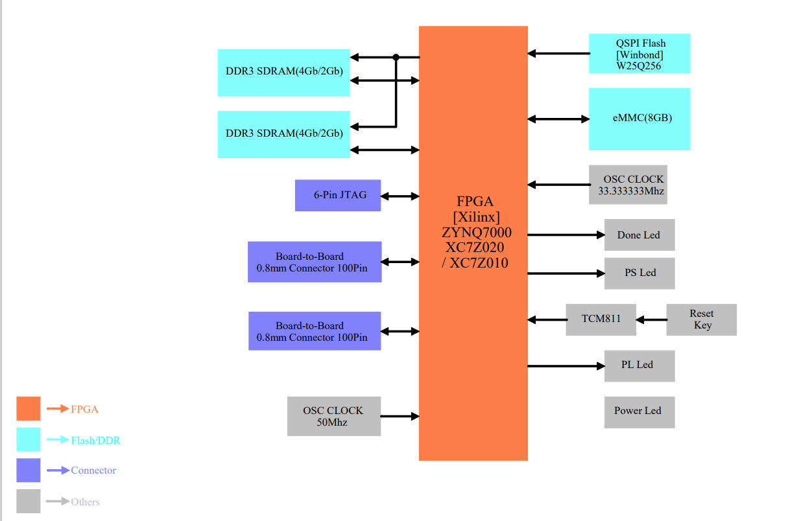

# Introduction

This is a hardware Core Board of  Xilinx FPGA ZYNQ7020/10. If it is helpful, please give our repo a star to make more people see it.

This is the basic diagram of the board.

You can find the carrier board with this repo https://github.com/Hello-FPGA/BISS-C-Board

You can find the software design with this repo https://github.com/Hello-FPGA/BISS-C

## QA

If you want more information or other request. Contact us with info@hello-fpga.com or QQ 947559581

